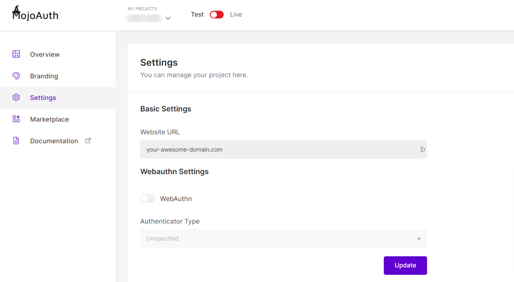

# Custom Redirection

Redirect your users to a specific URL after authentication once they click on the email magic link and get the JWT token at the redirect URL.

To achieve this use case, add the URL to your project’s setting as displayed in the below screen:

<div id="mojoauth-preview "style="text-align:center">
  
</div>
<br/>

## Using MojoAuth JS framework:

Pass one `redirect_url` param in the script where you create the instance of MojoAuth for login/signup.

```js
const mojoauth = new MojoAuth("Your MojoAuth API Key", {
  language: "it", //Localize your website according to a country or region.
  redirect_url: "https://example.com", //The URL where the user will be redirected after successful authentication. It can be http://localhost:5000.
})
```

Add the below code where you want to handle the redirection.

```js
const mojoauth = new MojoAuth( "Your MojoAuth API Key" );
 mojoauth.signInWithStateID()
 .then( payload => {
     console.log(payload)
  })
```

## Using MojoAuth APIs

Pass one `redirect_url` param in the Authentication API, check out [authentication API](https://mojoauth.com/docs/api/#send-magic-link-on-the-email) for reference. Authentication API will return the state_id to check further the login/verification status.

To get the verification status, use our status API. [Status API](https://mojoauth.com/docs/api/#check-authentication-status) will return the JWT token after successful verification.

## Sample JWT Token Response

```json
{
  "authenticated": true,
  "oauth": {
    "access_token": "eyJhbGciOi.....",
    "id_token": "eyJhbGciOiJ......",
    "refresh_token": "ad0****7-a134-4**e-9a76-9******a",
    "expires_in": "2021-12-28T12:30:30.016737094Z",
    "token_type": "Bearer"
  },
  "user": {
    "created_at": "2021-12-28T12:30:30.016736828Z",
    "updated_at": "2021-12-28T12:30:30.016736938Z",
    "issuer": "https://www.mojoauth.com",
    "user_id": "61******65332",
    "identifier": "example@example.com"
  }
}
```
