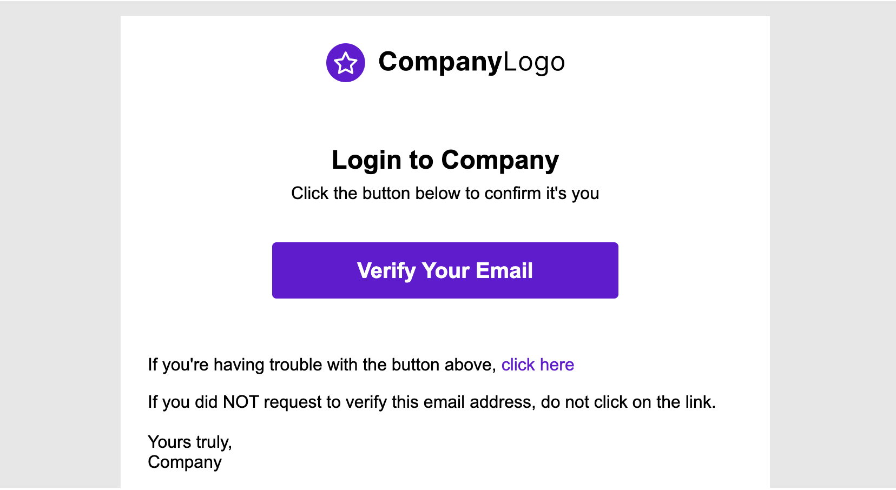

# Get Started - Angular

To communicate with MojoAuth you will need some details about the application. These details are required for setup and initiate the implementation of Passwordless Login.

## Getting Credentials

### Register at MojoAuth

Here you just need to follow three simple steps:

- Login to [MojoAuth](https://mojoauth.com/signin) Dashboard:

<div id="mojoauth-preview "style="text-align:center">
  
</div>
<br/>

- Create your Fist Project by adding your **Website URL** and **Project Name** as displyed in the below screen:

<div style="text-align:center">
  
</div>
<br/>

- Get your API Credentials, The API key and API Secret are used to interact with MojoAuth's APIs.

<div style="text-align:center">
  
</div>
<br/>

- Swtich webauthn on from the settings tab on the dashboard. Then choose the type of Authenticator you want to select for webAuthn.

<div style="text-align:center">
  
</div>
<br/>

## Integrate MojoAuth

To start Integrating MojoAuth, we need to install Angular CLI for creating an Angular app.

```
npm install -g @angular/cli
```

1. Using the Angular CLI, create an Angular app.

```
ng new mojoauth-app
cd mojoauth-app
```

2. Install MojoAuth npm module to create a MojoAuth instance.

```
npm install mojoauth-web-sdk
```

3. Import MojoAuth from 'mojoauth-web-sdk' in your app.component.ts inside App folder.

```jsx
import MojoAuth from "mojoauth-web-sdk"
```

4. Import OnInit function from '@angular/core' along with Component.

```jsx
import { Component, OnInit } from "@angular/core"
```

5. In the AppComponent class, define a title and a data object to receive the response and token from the mojoauth instance after successful authentication.

```jsx
export class AppComponent implements OnInit {
  title = 'mojoauth-app';
  data:any;
```

5. After the initialization, use the ngOnInit function to create the MojoAuth instance using your API Key obtained from your MojoAuth dashboard and pass the source object.

```jsx
ngOnInit():void{

    const mojoauth = new MojoAuth("71736bb0-8a9b-4f4d-8503-62355cfb030b", {
      source: [{ type: "email", feature: "magiclink" }],
    });
    mojoauth.signIn().then((response:any) => {
        this.data=JSON.stringify(response, null, 4)
        console.log(response)
        });

  }
```

6. To login using Email OTP or SMS Authentication, just change the source object.

```js
{
  language: 'language_code',
  redirect_url: "your_redirect_url",
  source: [{ type: "email", feature: "otp" }],
})
```

**OR**

```js
{
  language: 'language_code',
  redirect_url: "your_redirect_url",
  source: [{ type: "phone", feature: "otp" }],
})
```

> You can also use multiple Authentication methods by passing multiple objects in source Array.

```js
const mojoauth = new MojoAuth("Your MojoAuth API Key", {
  language: "language_code",
  redirect_url: "your_redirect_url",
  source: [
    { type: "email", feature: "magiclink" },
    { type: "phone", feature: "otp" },
  ],
})
```

7. Add the following div inside your app.component.html where you want the MojoAuth passwordless login form to be rendered.

```jsx
<div id="mojoauth-passwordless-form"></div>
```

> MojoAuth passwordless login form will be rendered in the above div on your web page.

8. After you have been logged in, enable WebAuthn form will be rendered if you have enabled it in your MojoAuth dashboard.

<div style="text-align:center">
  
</div>
<br/>

> You can enable webauthn here or you can skip it to log in to your web application. After enabling webauthn, the prompt to enter your Security Key/Fingerprint will appear. As soon as you enter your key/fingerprint, your device will be registered and you will be logged in.

The next time you log in, you will directly be prompted to enter the key/fingerprint. After verifying you will be logged in.

10. Display the user data in your app.component.html using the data object defined in your AppComponent after the user is successfully logged in.

```jsx
<pre>{{ data }}</pre>
```

## Example

#### app.component.ts

```jsx
import { Component, OnInit } from "@angular/core"
import MojoAuth from "mojoauth-web-sdk"
@Component({
  selector: "app-root",
  templateUrl: "./app.component.html",
  styleUrls: ["./app.component.css"],
})
export class AppComponent implements OnInit {
  title = "mojoauth-app"
  data: any
  ngOnInit(): void {
    const mojoauth = new MojoAuth("APIKEY", {
      source: [{ type: "email", feature: "magiclink" }],
    })
    mojoauth.signIn().then((response: JSON) => {
      this.data = JSON.stringify(response, null, 4)
      console.log(response)
    })
  }
}
```

#### app.component.html

```html
<div id="mojoauth-passwordless-form"></div>
<pre>{{data}}</pre>
```

## Mojouth Passwordless Login Flow

After completing the above steps the following will be the flow of passwordless login in your web application.

### MojoAuth Login Interface

- User will enter their email address and if they have enabled webauthn they will be asked to verify their security key/fingerprint

<div style="text-align:center">
  
</div>
<br/>

- After successfully verifying their security key/fingerprint, they will be logged into their web application.

- Alternatively, they can opt to receive a link to login to their email address. On clicking the magic link user will be successfully verified and logged into the web application.

<div style="text-align:center">
  
</div>
<br/>

## Enabling WebAuthn for logged-in user

- If the user skips enabling webauthn for the first time, 'Enable webauthn' function can be used to trigger webauthn registration once they have logged in

```js
mojoauth.enableWebauthn(data.oauth.access_token)
```

- Access token would be available in the data object after successful login.

## Keep Reading

[How to handle MojoAuth token?](/howto/handle-jwt-token/)
