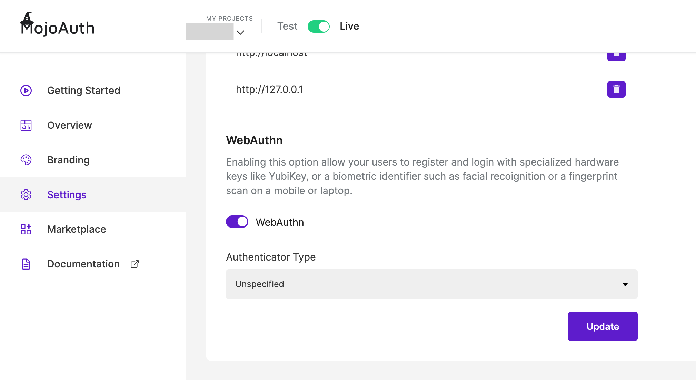

# Get Started - HTML and JS

To communicate with MojoAuth you will need some details about the application. These details are required for setup and initiate the implementation of Passwordless Login.

## Getting Credentials

### Register at MojoAuth

Here you just need to follow three simple steps:

- Login to [MojoAuth](https://mojoauth.com/dashboard/signin) Dashboard:

<div id="mojoauth-preview "style="text-align:center">
  
</div>
<br/>

- Create your Fist Project by adding your **Website URL** and **Project Name** as displyed in the below screen:

<div style="text-align:center">
  
</div>
<br/>

- Get your API Credentials, The API key and API Secret are used to interact with MojoAuth's APIs.

<div style="text-align:center">
  
</div>
<br/>

- Swtich webauthn on from the settings tab on the dashboard. Then choose the type of Authenticator you want to select for webAuthn.

<div style="text-align:center">
  
</div>
<br/>

## Integrate MojoAuth

To start Integrating MojoAuth in your web app, add MojoAuth javascript SDK in the head of your webpage and follow the mentioned steps:

```js
<script
  src="https://cdn.mojoauth.com/js/mojoauth.min.js"
  type="text/javascript"
></script>
```

1. Create MojoAuth instance with your api key and pass the source as an object.

```js
const mojoauth = new MojoAuth("Your MojoAuth API Key", {
  language: "language_code",
  redirect_url: "your_redirect_url",
  source: [{ type: "email", feature: "magiclink" }],
})
```

2. To login using Email OTP or SMS Authentication, just change the source object.

```js
{
  language: 'language_code',
  redirect_url: "your_redirect_url",
  source: [{ type: "email", feature: "otp" }],
})
```

**OR**

```js
{
  language: 'language_code',
  redirect_url: "your_redirect_url",
  source: [{ type: "phone", feature: "otp" }],
})
```

> You can also use multiple Authentication methods by passing multiple objects in source Array.

```js
const mojoauth = new MojoAuth("Your MojoAuth API Key", {
  language: "language_code",
  redirect_url: "your_redirect_url",
  source: [
    { type: "email", feature: "magiclink" },
    { type: "phone", feature: "otp" },
  ],
})
```

3. Add the following div on your web page where you want the MojoAuth passwordless login form to be rendered

```js
<div id="mojoauth-passwordless-form"></div>
```

> MojoAuth passwordless login form will be rendered in the above div on your web page

4. Add the MojoAuth passwordless login with the following method. The response would be handled in .then() function.

```js
mojoauth.signIn().then(response => console.log(response))
```

## Example

```js
<!DOCTYPE html>
  <head>
   <script    src="https://cdn.mojoauth.com/js/mojoauth.min.js">
   </script>
  </head>
  <body>
     <div id="mojoauth-passwordless-form"></div>
      <script>
        const mojoauth = new MojoAuth("Your MojoAuth API Key", {
          language: 'language_code',
          redirect_url: "your_redirect_url",
          source: [{ type: "email", feature: "magiclink" }],
        })
        // Use source:[{type: "email", feature: "otp"}] for authentication using Email OTP
        // Use source:[{type: "phone", feature: "otp"}] for authentication using SMS Authentication

        mojoauth.signIn().then(response => console.log(response));
      </script>

  </body>
</html>
```

## Mojouth Passwordless Login Flow

After completing the above steps the following will be the flow of passwordless login in your web application.

### MojoAuth Login Interface

- User will enter their email address and if they have enabled webauthn they will be asked to verify their security key/fingerprint

<div style="text-align:center">
  
</div>
<br/>

- After successfully verifying their security key/fingerprint, they will be logged into their web application.

- Alternatively, they can opt to receive a link to login to their email address. On clicking the magic link user will be successfully verified and logged into the web application.

<div style="text-align:center">
  
</div>
<br/>

- If the user has passed the optional parameter 'redirect_url', they have to include the following function on their redirection page to get logged in directly.

```js
const mojoauth = new MojoAuth("Your MojoAuth API KEY")

mojoauth.signInWithStateID().then(payload => {
  console.log(payload)
})
```

## Enabling WebAuthn for logged-in user

- If the user skips enabling webauthn for the first time, 'Enable webauthn' function can be used to trigger webauthn registration once they have logged in.

Please check the code below for enableWebauthn function:

```js
mojoauth
  .enableWebauthn(response.oauth.access_token)
  .then(response => {
    // success
    console.log(response)
  })
  .catch(e => {
    // handle the cancellation of webauthn
    console.log(e)
  })
```

or if you use await, try the below code-

```js
try {
  var data = await mojoauth.enableWebauthn(response.oauth.access_token)
  if (data.authenticated) {
    console.log("WebAuthn is Registered")
  }
} catch (error) {
  // handle the registration/login cancel
  console.log(error)
}
```

- Access token would be available in the payload under oauth after successful login.

## Keep Reading

[How to handle MojoAuth token?](/howto/handle-jwt-token/)
