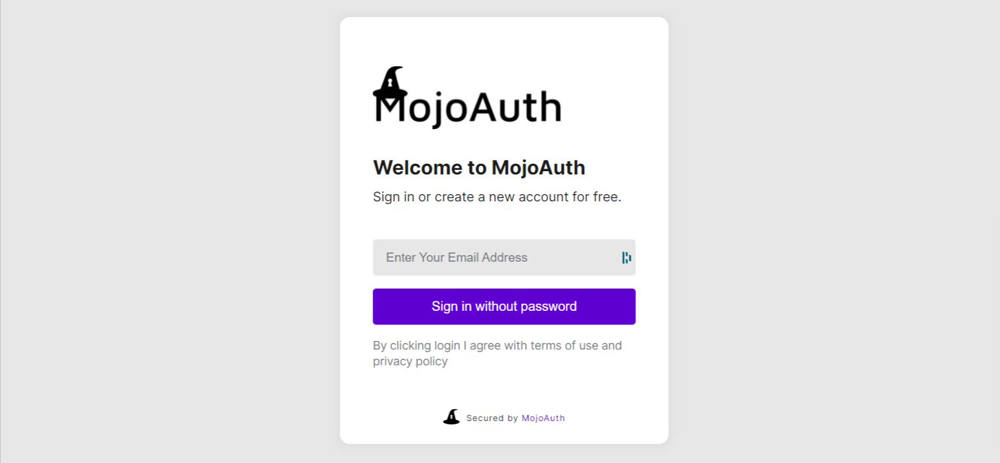
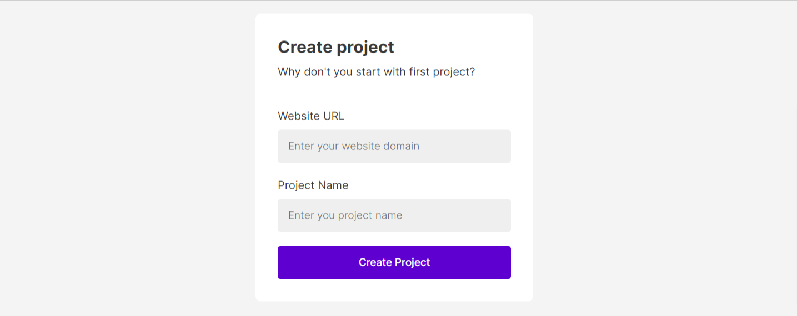
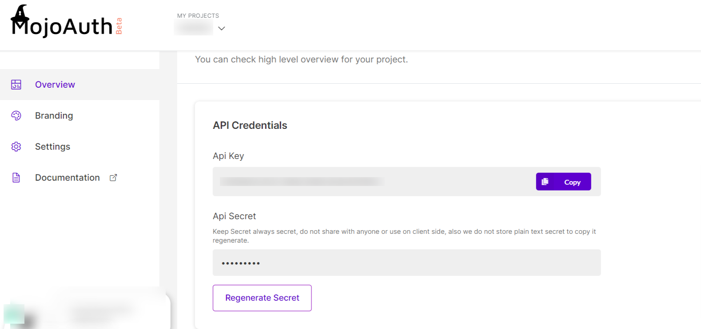
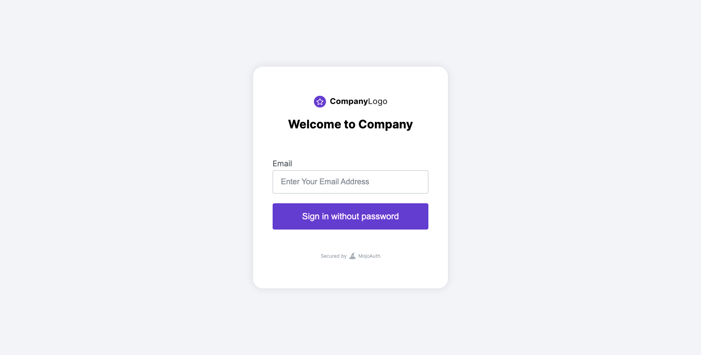
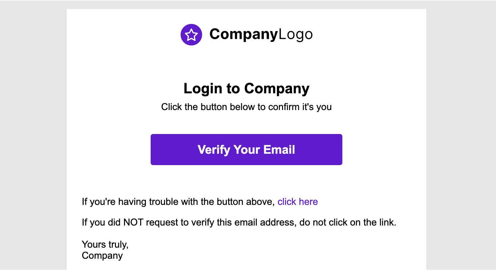

# Get Started - JAVA

To communicate with MojoAuth you will need some details about the application. These details are required for setup and initiate the implementation of Passwordless Login.

## Getting Credentials

### Register at MojoAuth

Here you just need to follow three simple steps:

- Login to [MojoAuth](https://mojoauth.com/signin) and the below screen appear:

<div style="text-align:center">
  
</div>
<br/>

- Create your Fist Project by adding your **Website URL** and **Project Name** as displyed in the below screen:

<div style="text-align:center">
  
</div>
<br/>

- Get your API Credentials, The API key and API Secret are used to interact with MojoAuth's APIs.

<div style="text-align:center">
  
</div>
<br/>

## Integrate MojoAuth

To start Integrating MojoAuth in your web app, add MojoAuth javascript sdk in the head of your webpage and follow below mentioned steps:

```js
<script
  src="https://cdn.mojoauth.com/js/mojoauth.min.js"
  type="text/javascript"
></script>
```

1. Create MojoAuth instance with your api key

```js
const mojoauth = new MojoAuth("Your MojoAuth API Key")
```

2. Add the following div on your web page where you want the MojoAuth passwordless login form to be rendered

```js
<div id="mojoauth-passwordless-form"></div>
```

> MojoAuth passwordless login form will be rendered in the above div on your web page

3. Add the MojoAuth passwordless login using **Magic Link** with the following method. The response would be handled in .then() function.

```js
mojoauth.signInWithMagicLink().then(response => console.log(response))
```

**or**

4. Add the MojoAuth passwordless login using **Email OTP** with the following method. The response would be handled in .then() function.

```js
mojoauth.signInWithEmailOTP().then(response => console.log(response))
```

## Example

```js
<!DOCTYPE html>
  <head>
   <script    src="https://cdn.mojoauth.com/js/mojoauth.min.js">
   </script>
  </head>
  <body>
     <h2>MojoAuth Demo </h2>
     <div id="mojoauth-passwordless-form"></div>
      <script>
        const mojoauth = new MojoAuth("Your MojoAuth API Key");
        // Use signInWithEmailOTP() for authentication using Email OTP
        mojoauth.signInWithMagicLink().then(response => console.log(response));
      </script>

  </body>
</html>
```

## Mojouth Passwordless Login Flow

After completing the above steps the following will be the flow of passwordless login in your web application.

### MojoAuth Login Interface

- User will enter their email address to receive a link to login to their email address.

<div style="text-align:center">
  
</div>
<br/>

- On clicking the magic link user will be successfully logged into the web application.

<div style="text-align:center">
  
</div>
<br/>

## MojoAuth Token

After successful authentication, MojoAuth provides a JWT Token. You can use this token for your further implementation. MojoAuth also provides the way you can verify the authenticity of this token using MojoAuth JAVA SDK.

## Setup and Install SDK

#### Manual Installation

- Right click on your project in eclipse.
- Select Build Path.
- Click on Configure Build Path.
- Click on Libraries and select Add External JARs.
- Select the jar file from your computer.
- Hit and Apply button.

#### Automatic Installation

MojoAuth is now using Maven. At present the jars are available from a public maven repository.

Use the following dependency in your project.

```JAVA
<dependency>
  <groupId>com.mojoauth.sdk</groupId>
  <artifactId>java-sdk</artifactId>
  <version>1.1.0</version>
</dependency>

```

> The jars are also available [here](https://mvnrepository.com/artifact/com.mojoauth.sdk/java-sdk/1.0.0). Select the directory for the latest version and download the jar files.

### Configure Project

Before using the SDK, you must initialize the SDK with the help of following code: API Key and secret of your MojoAuth site.

```java
MojoAuthSDK.Initialize init = new MojoAuthSDK.Initialize();
init.setApiKey("___MOJOAUTH_APIKEY___");
```

### Verify JWT Token

Use the MojoAuth `verifyAccessToken()` Method to verify the MojoAuth JWT token.

```java
  String token = "<token>";
Jwks jwks = new Jwks();
jwks.verifyAccessToken(token, new AsyncHandler<VerifyTokenResponse>() {

	@Override
	public void onSuccess(VerifyTokenResponse data) {
		System.out.println(data.getAccessToken());
		System.out.println(data.getIsValid());
	}

	@Override
	public void onFailure(ErrorResponse errorcode) {
		System.out.println(errorcode.getMessage());
		System.out.println(errorcode.getDescription());
	}
});
```

## Keep Reading

[How to handle MojoAuth token?](/howto/handle-jwt-token/)
