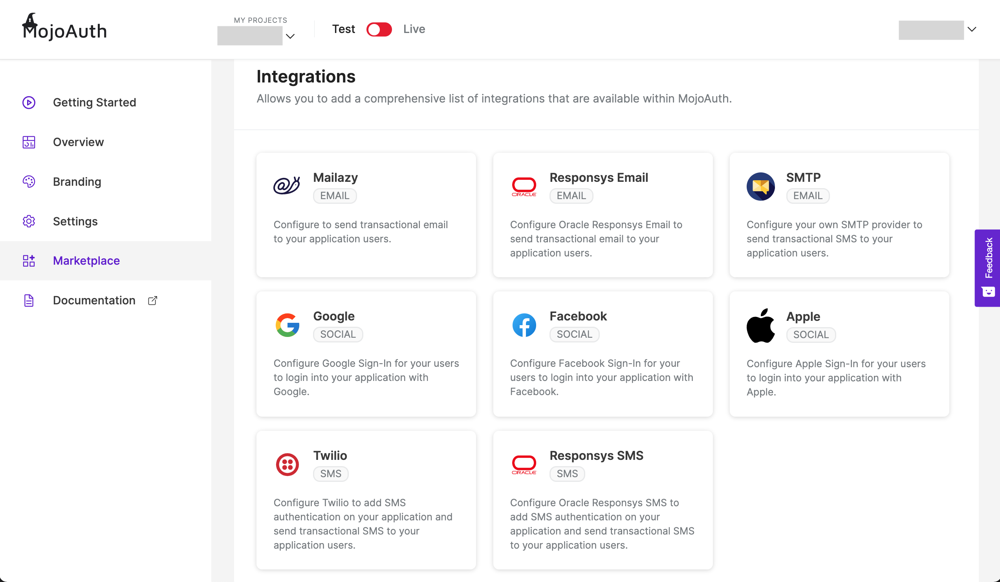
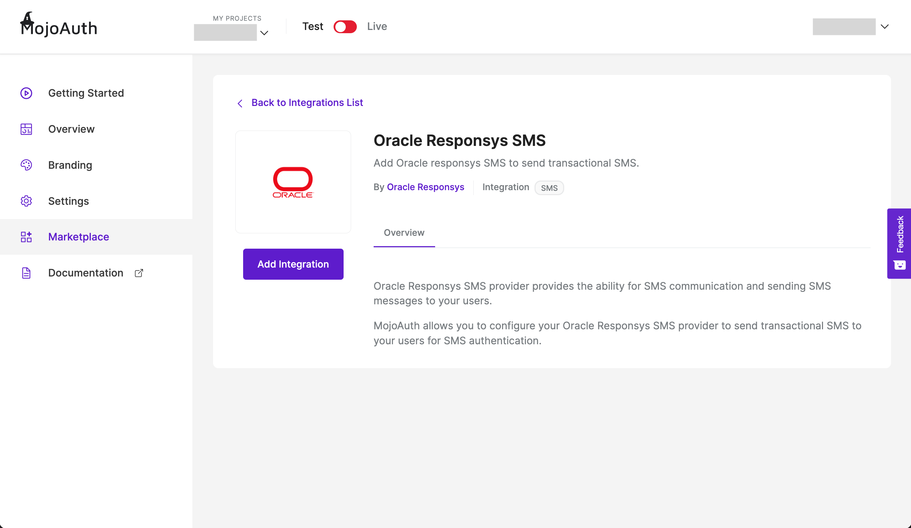
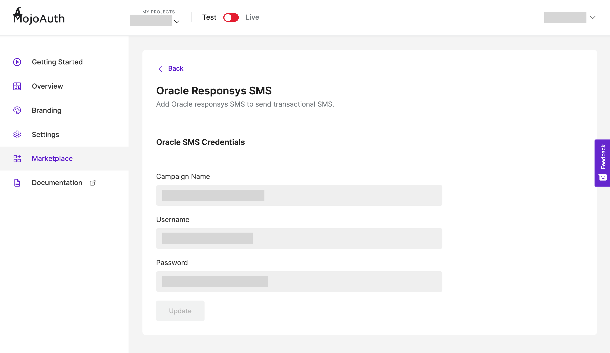

# Get Started - Integrate Oracle Responsys SMS

This guide explains how to add and configure the Oracle Responsys SMS to your application using MojoAuth Dashboard. You can implement SMS Authentication using responsys SMS for a quick and convenient approach for consumer registration and login.

## Dashboard Configuration

#### Sign in to your MojoAuth Account

After signing in to your [MojoAuth Account](https://mojoauth.com/dashboard/overview), navigate to Marketplace and click on Add Integrations.

<div style="text-align:center">
  
</div>
<br/>

#### Select Responsys SMS Provider

Pick the SMS provider you want to integrate to your application.

<div style="text-align:center">
  
</div>
<br/>

#### Configure Responsys SMS

Click on Add Integration to configure Responsys SMS.

<div style="text-align:center">
  
</div>
<br/>

To get your Responsys SMS credentials, create your campaign on Oracle Responsys SMS.

The very first REST API request needs to authenticate to a specific Responsys account using a username and a password or certificates. Enter your Campaign Name, Username and password to allow MojoAuth to send transactional SMS to your users.

<div style="text-align:center">
  
</div>
<br/>

This is the sample request body we send for you to customise for your individual user.

```json
"mergeTriggerRecordData": {
          "mergeTriggerRecords": [
              {
                  "fieldValues": [
                      "13478046509",
                      "US",
                      "O"
                  ],
                  "optionalData": [
                  {
                      "name": "MOJO_CODE",
                      "value": "ABC123"
                  },
              ]

              },

         ],
        "fieldNames": [
              "MOBILE_NUMBER_",
              "MOBILE_COUNTRY_",
              "MOBILE_PERMISSION_STATUS_"
         ]
      },
```

## Integrate SMS Authentication

To start Integrating MojoAuth in your web app, add MojoAuth javascript SDK in the head of your webpage and follow the mentioned steps:

```js
<script
  src="https://cdn.mojoauth.com/js/mojoauth.min.js"
  type="text/javascript"
></script>
```

- Create MojoAuth instance with your apikey

```js
config = {
  language: "en",
  redirect_url: "http://localhost:8080/test",
  source: [{ type: "phone", feature: "otp" }],
}

const mojoauth = new MojoAuth("Your API Key", config)
mojoauth.signIn().then(response => console.log(response))
```

> Localize your website according to a country or region, checkout [Localization](/configurations/localization/) guide for more details.

> In case of multiple sources required, just pass the source in the array.

```js
config = {
  language: "en",
  redirect_url: "http://localhost:8080/test",
  source: [
    { type: "phone", feature: "otp" },
    { type: "email", feature: "magiclink" },
  ],
}
```

- Add the following div on your web page where you want the MojoAuth passwordless login form to be rendered

```js
<div id="mojoauth-passwordless-form"></div>
```

> MojoAuth passwordless login form will be rendered in the above div on your web page

- Add the MojoAuth passwordless login using **SMS Authentication** with the following method. The response would be handled in .then() function.

```js
mojoauth.signIn().then(response => console.log(response))
```

### Example

```js
<!DOCTYPE html>
  <head>
   <script    src="https://cdn.mojoauth.com/js/mojoauth.min.js">
   </script>
  </head>
  <body>
     <div id="mojoauth-passwordless-form"></div>
      <script>
    config = {
            language: "en",
            redirect_url: "http://localhost:8080/test",
            source: [ {type:'phone',feature:'otp'} ],
        }
    const mojoauth = new MojoAuth( "API_KEY", config);
    mojoauth.signIn().then( response => {

            console.log( response )
        } );
      </script>
  </body>
</html>
```

## Keep Reading

[How to handle MojoAuth token?](/howto/handle-jwt-token/)

[How to add custom redirection to your application?](/configurations/redirection/)

[How to add Social Login for your application users?](/howto/social-login/)
