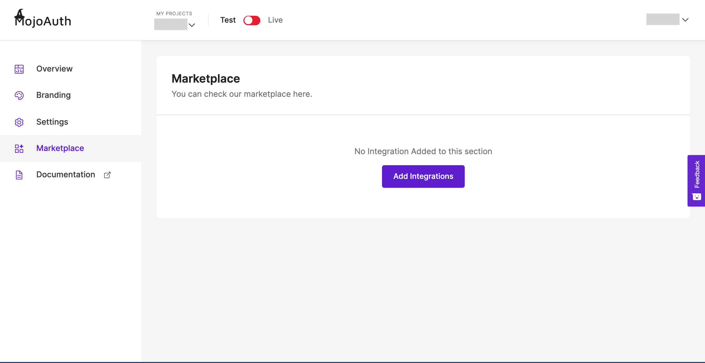
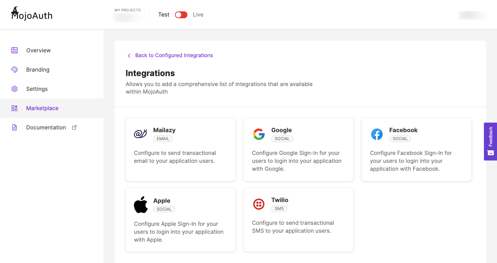
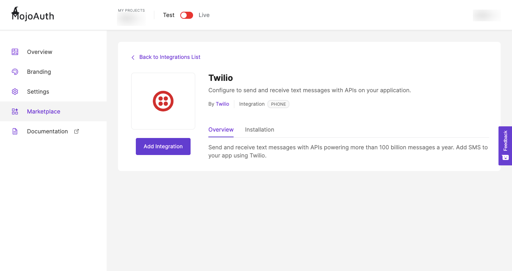
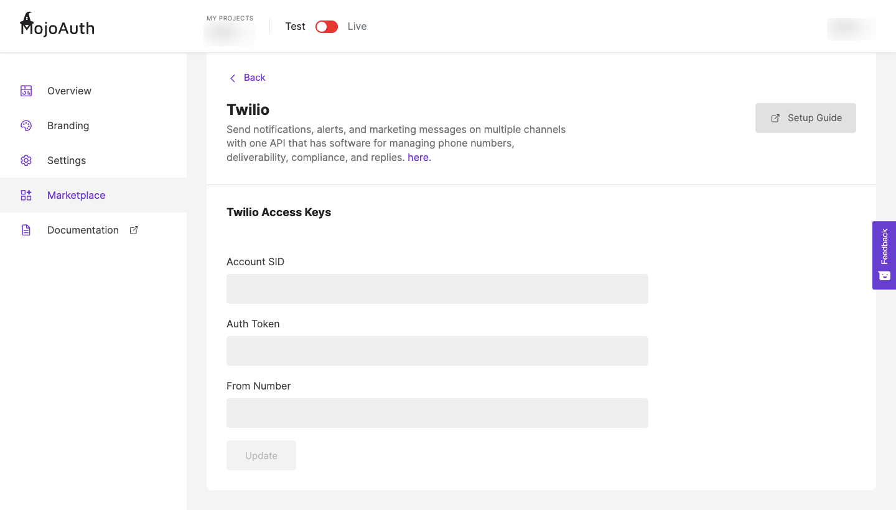

# Get Started - Phone Login

This guide explains how to add and configure the Phone Login to your application using MojoAuth Dashboard. You can implement Phone Login for a quick and convenient approach for consumer registration and login.

## Dashboard Configuration

#### Sign in to your MojoAuth Account

After signing in to your [MojoAuth Account](https://mojoauth.com/dashboard/overview), navigate to Marketplace and click on Add Integrations.

<div style="text-align:center">
  
</div>
<br/>

#### Select Twilio SMS Provider

Pick the SMS provider you want to integrate to your application.

<div style="text-align:center">
  
</div>
<br/>

#### Configure Phone Login

Click on Add Integration and your Twilio configure if you have your credentials.

<div style="text-align:center">
  
</div>
<br/>

To add your Twilio credentials, click on setup guide and follow the instructions to obtain your access keys.

<div style="text-align:center">
  
</div>
<br/>

## Integrate Phone Login

To start Integrating MojoAuth in your web app, add MojoAuth javascript SDK in the head of your webpage and follow the mentioned steps:

```js
<script
  src="https://cdn.mojoauth.com/js/mojoauth.min.js"
  type="text/javascript"
></script>
```

- Create MojoAuth instance with your apikey

```js
config = {
  language: "en",
  redirect_url: "http://localhost:8080/test",
  source: [{ type: "phone", feature: "otp" }],
}

const mojoauth = new MojoAuth("Your API Key", config)
mojoauth.signIn().then(response => console.log(response))
```

> Localize your website according to a country or region, checkout [Localization](/configurations/localization/) guide for more details.

> In case of multiple sources required, just pass the source in the array.

```js
config = {
  language: "en",
  redirect_url: "http://localhost:8080/test",
  source: [
    { type: "phone", feature: "otp" },
    { type: "email", feature: "magiclink" },
  ],
}
```

- Add the following div on your web page where you want the MojoAuth passwordless login form to be rendered

```js
<div id="mojoauth-passwordless-form"></div>
```

> MojoAuth passwordless login form will be rendered in the above div on your web page

- Add the MojoAuth passwordless login using **Phone Login** with the following method. The response would be handled in .then() function.

```js
mojoauth.signIn().then(response => console.log(response))
```

### Example

```js
<!DOCTYPE html>
  <head>
   <script    src="https://cdn.mojoauth.com/js/mojoauth.min.js">
   </script>
  </head>
  <body>
     <h2>MojoAuth Demo </h2>
     <div id="mojoauth-passwordless-form"></div>
      <script>
    config = {
            language: "en",
            redirect_url: "http://localhost:8080/test",
            source: [ {type:'phone',feature:'otp'} ],
        }
    mojoauth.signIn().then( response => {

            console.log( response )
        } );
      </script>
  </body>
</html>
```

## Keep Reading

[How to Integrate Mailazy to your application?](/howto/email-whitelisting/)

[How to add custom redirection to your application?](content/configurations/redirection)
