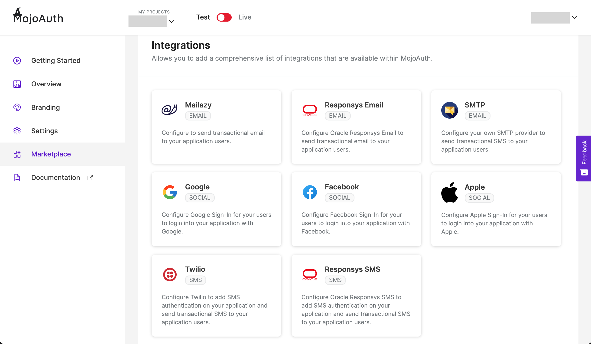
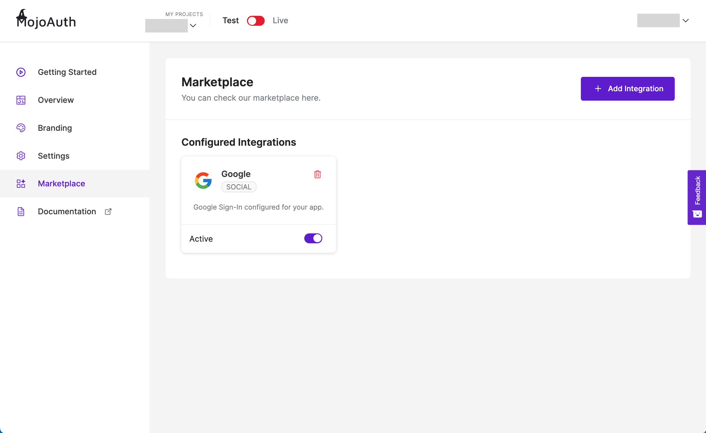

# Get Started - Social Login

This guide explains how to add and configure the desired Social Login providers on your application using MojoAuth Dashboard. You can implement Social Login for a quick and convenient approach for consumer registration and login.

## Dashboard Configuration

#### Sign in to your MojoAuth Account

After signing in to your [MojoAuth Account](https://mojoauth.com/dashboard/overview), navigate to Marketplace and click on Add Integrations.

<div style="text-align:center">
  
</div>
<br/>

#### Select Social Login Provider

Pick the social login you want to integrate to your application.

<div style="text-align:center">
  
</div>
<br/>

Depending on the social login you picked, the following screen will appear.

<div style="text-align:center">
  
</div>
<br/>

#### Configure Social Login

Click on Add Integration and configure your Social Login if you have your social ID and secret.

<div style="text-align:center">
  
</div>
<br/>

To get your ID and secret, click on setup guide and follow the instructions to obtain your access keys.

<div style="text-align:center">
  
</div>
<br/>

Alternatively, you can also access the setup guide on the integration page under the tab Installation.

<div style="text-align:center">
  
</div>
<br/>

#### Update the Key and Secret

After obtaining the access keys following the above steps, enter the access keys on the integrations page and update.

<div style="text-align:center">
  
</div>
<br/>

Your Social login is now configured. You can see the configured social logins under configured Integrations on the marketplace page.

<div style="text-align:center">
  
</div>
<br/>

## Integrate Social Login

To start Integrating MojoAuth in your web app, add MojoAuth javascript SDK in the head of your webpage and follow the mentioned steps:

```js
<script
  src="https://cdn.mojoauth.com/js/mojoauth.min.js"
  type="text/javascript"
></script>
```

- Create MojoAuth instance with your api key

```js
const mojoauth = new MojoAuth("Your MojoAuth API Key")
```

- Pass the parameters for language selection and redirection URL

```js
const mojoauth = new MojoAuth("Your MojoAuth API Key", {
  language: "language_code",
  redirect_url: "your_redirect_url",
})
```
> Localize your website according to a country or region, checkout [Localization](/configurations/localization/) guide for more details.

> Redirect URL is a required parameter to configure social login in your application. [Whitelist your domain](/configurations/redirection/) to get social login working on your app.

- Add the following div on your web page where you want the MojoAuth passwordless login form to be rendered

```js
<div id="mojoauth-passwordless-form"></div>
```

> MojoAuth passwordless login form will be rendered in the above div on your web page

- Add the MojoAuth passwordless login using **Magic Link** with the following method. The response would be handled in .then() function.

```js
mojoauth.signInWithMagicLink().then(response => console.log(response))
```

**or**

- Add the MojoAuth passwordless login using **Email OTP** with the following method. The response would be handled in .then() function.

```js
mojoauth.signInWithEmailOTP().then(response => console.log(response))
```

### Example

```js
<!DOCTYPE html>
  <head>
   <script    src="https://cdn.mojoauth.com/js/mojoauth.min.js">
   </script>
  </head>
  <body>
     <h2>MojoAuth Demo </h2>
     <div id="mojoauth-passwordless-form"></div>
      <script>
        const mojoauth = new MojoAuth("Your MojoAuth API Key", {language:"en", redirect_url:"https://www.example.com"});
        // Use signInWithEmailOTP() for authentication using Email OTP
        mojoauth.signInWithMagicLink().then(response => console.log(response));
      </script>
  </body>
</html>
```

## Mojouth Passwordless Login Flow

After completing the above steps the following will be the flow of passwordless login in your web application.

### MojoAuth Login Interface

- To log in to the account using social login, user need to click on the google icon on their login interface and verify using your google credentials.

<div style="text-align:center">
  
</div>
<br/>

- After a successful verification, user will be redirected to their application.

> Note - Redirect URL must be present in the config passed to the MojoAuth instance.

- Alternatively, they can opt to receive a link to login to their email address. On clicking the magic link user will be successfully verified and logged into the web application.

<div style="text-align:center">
  
</div>
<br/>

## Supported Social Providers

The following is the list of supported social providers -

- Google

- Facebook

- Apple

We are working on more social login support. If you want a specific social login, please raise a request [here](https://mojoauthassist.freshdesk.com/support/tickets/new).

## Keep Reading

[How to Integrate Mailazy to your application?](/howto/email-whitelisting/)
[How to add custom redirection to your application?](content/configurations/redirection)
