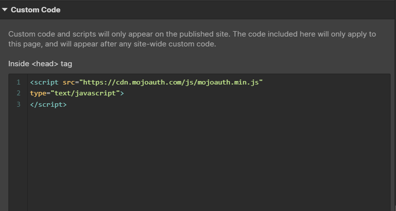

# GetStarted - Webflow

To use MojoAuth in your application, you will need an account and some credentials. These credentials are required to setup and initiate the implementation of Passwordless Login.

## Step 1: Creating an account in MojoAuth

Here you just need to follow three simple steps:

- Login to [MojoAuth](https://mojoauth.com/signin) and the below screen appear:

<div style="text-align:center">
  
</div>
<br/>

- Create your Fist Project by adding your **Website URL** and **Project Name** as displyed in the below screen:

<div style="text-align:center">
  
</div>
<br/>

- Get your API Credentials; the API key and API Secret are used to interact with MojoAuth's APIs.

<div style="text-align:center">
  
</div>
<br/>

## Step 2: Webflow Setup

**Note:** This tutorial uses Webflow's Custom Code, which is only available on paid Webflow accounts.

In this tutorial, We will create two pages in Webflow: Login Page (/) and Protected Page (/protected). You will see the embedded MojoAuth login form on the login page in which users can enter their email address, and the protected page contains the protected content we only want a logged-in user to see.

First, Sign up for a Webflow account [here](https://webflow.com/dashboard/signup). Create a new project with a Blank Site template and create two empty pages, Login and Protected.

### Login Page

On the login page, first, add a section element with id `mojoauth-passwordless-form`. This section will be used to load the MojoAuth login form. Then we need to add the MojoAuth JS SDK code to the page. For that, click on the setting button in front of the page name.

<div style="text-align:center">
  
</div>
<br/>

Then in custom code, enter the MojoAuth JS SDK path and the JS code to initialize the login form.

<div style="text-align:center">
  
</div>
<br/>

Copy-paste the below-mentioned code in the `Before </body> tag` section of custom code as shown in the screenshot.

```JS
<script>
  const apikey = "<Add Your API Key>";
  const mojoauth = new MojoAuth(apikey);
  // Use signInWithEmailOTP() for authentication using Email OTP
  mojoauth.signInWithMagicLink().then(response => {
  		alert("Please check console to see profile data");
      console.log(response);
      // save the userData in local storage
      if (response.authenticated == true) {
        localStorage.setItem('userToken', response.oauth.access_token);
        window.location.href = "/protected";
      }
  });
</script>
```

<div style="text-align:center">
  
</div>
<br/>
<br/>

**Note:** In the above code, replace the `<Add Your API Key>` with your project's API Key. You can find your API Key in MojoAuth Dashboard.

The above code will render the MojoAuth login form. Once the user gets authenticated, it will redirect the user to the protected page while saving the user's access token in the local storage.

### Protected Page

On the protected page, we put content which only logged-in users can see. As soon as a user is logged in, he will be redirected to the protected page.

Let's add validation on the protected page so that no user will access the protected page without logging in. We will use the access token saved in local storage for that.

Add the below code in the `Before </body> tag` section of custom code, and it will redirect the unauthorized user to the login page.

```JS
<script>
	var AccessToken = localStorage.getItem('userToken');

  // If we don't find access token redirect it to login page
  if (!AccessToken) {
  	window.location.href = "/"
  }

  const apikey =  "<Add Your API Key>";
  const mojoauth = new MojoAuth(apikey);

  // Use verifyToken() for token verification
	mojoauth.verifyToken(AccessToken).then(response => {
    if (!response.isValid || response.isValid == false) {
			window.location.href = "/"
    }
  })
</script>
```

## Step 3: Publish the site

After doing all the steps, you need to publish the site. There is a publish button on the top right corner, click, and you can test MojoAuth authentication for your Webflow application!

<div style="text-align:center">
  
</div>
<br/>
