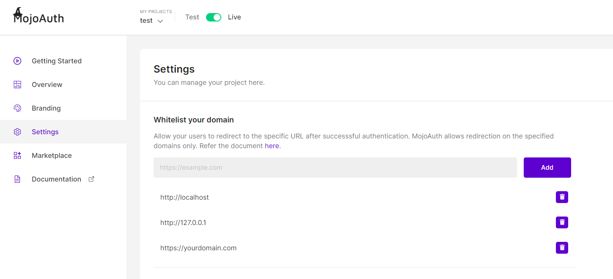

# MojoAuth Passwordless Authentication

WordPress is an open-source and free content material management system that is written in PHP and uses MySQL or MariaDB databases. WordPress features have a plugin architecture and different templates, which are regularly referred to as WordPress Themes.

## Installation

- Navigate to WordPress Admin Panel -> Plugins
- Click the &quot;Add New&quot; button
- To set up the MojoAuth plugin, type &quot;MojoAuth&quot; in the search box, or use the &quot;Upload Plugin&quot; button. You can use the plugin that was once provided to you through the MojoAuth workforce or can download the default plugin right here.

  

 

## Activation

- To turn on the plugin, navigate to WordPress Admin Panel-\&gt;MojoAuth
- On the Setting, input your API Key, And click on &quot;Get Public Certificate&quot; to get the Certificate Automatically.
- Select language to localize your website according to your country or region.

  

 

- After getting successfully &quot;Public Certificate&quot;
- Click &#39;Save Settings&#39;.

## Interfaces

Following are the user Interfaces provided by MojoAuth for end-user:

#### Authentication Interface

Authentication interfaces can be used from the login page created after the plugin activation from the admin panel.

  

 

#### Email verification Message Interface

Email verification Message interfaces can be used from the login page created after the email enter by the end-user for use login services.

  

 

#### Verify Email Interface

This interface is showing as an email template on the end-user email inbox. That allow to verify account on click and as it&#39;s verified it will allow login functionality in WordPress Website.

  

 

#### Successfully Verified Interface

This Interface will Show after successfully verify email from the end-user email account and parallel it allow login on WordPress Website on the previous tab that open WordPress Website.

  

 

#### Custom Redirection

Custom Redirection will redirect your user to the URL where your Wordpress application is running. To achieve this, Add the URL to your project setting as highlighted in the below screen.

  

 

> **_Note_**: Please note that this will not showcase the successfully verified screen and the user will get login directly on verifying the email.

### Where to see user details in the database?

- You can see the user&#39;s email id and username in the &quot;PREFIX_users&quot; Table.
- And plugin options config in the &quot;PREFIX_options&quot; Table.

### How to troubleshoot the plugin?

While Troubleshooting, be sure to take a look at the following issues:

- WordPress plugin uses `wp_remote_request` serve to run APIs that do not directly call cURL or fsockopen, so please make sure that cURL stays open on the server.
- WordPress plugin used `chilkat_9_5_0` so please make sure that chilkat_9_5_0 stays open on the server.
- If you have got enabled any caching plugin to your website online, then please you should definitely clear the cache from it after making any update/customization to the plugin.

### How to Uninstall plugin?

To uninstall the plugin move to the installed plugin phase and click on deactivate button below the &quot;MojoAuth&quot; choose to deactivate from Bulk Action and click on Apply button.

---

**Note:**

On uninstallation of the plugin, the entire options settings shall be deleted from the &quot;PREFIX_options&quot; Table.

---
