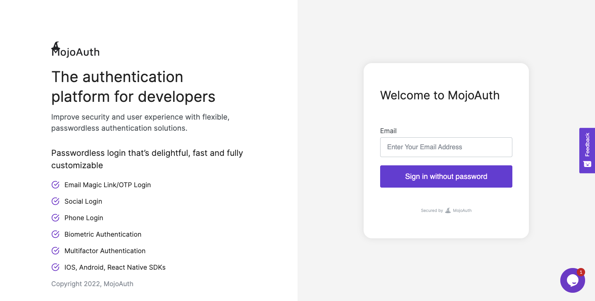
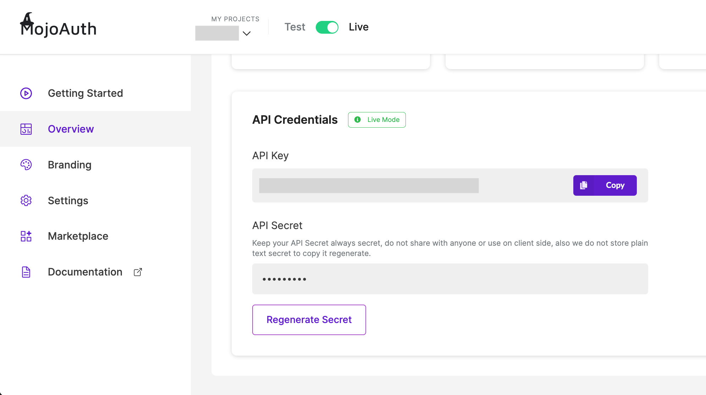

# Get Started - Android

To communicate with MojoAuth you will need some details about the application. These details are required for setup and initiate the implementation of Passwordless Login.

## Getting Credentials

### Register at MojoAuth

Here you just need to follow three simple steps:

- Login to [MojoAuth](https://mojoauth.com/signin) Dashboard:

<div style="text-align:center">
  
</div>
<br/>

- Create your Fist Project by adding your **Website URL** and **Project Name** as displyed in the below screen:

<div style="text-align:center">
  
</div>
<br/>

- Get your API Credentials, The API key and API Secret are used to interact with MojoAuth's APIs.

<div style="text-align:center">
  
</div>
<br/>

## Integrate MojoAuth

To start Integrating MojoAuth using Android sdk, follow below mentioned steps:

- To download the SDK, please go to the [MojoAuth github repository](https://github.com/MojoAuth/android-sdk).

- For Gradle based installation, add the following dependency in your app's build.gradle:

```
implementation 'com.mojoauth.android:mojoauth-sdk:1.2.0'
```

### Prerequisites

1.  Android SDK Version >= 16
2.  Build Tools Version = 28.0.0 (changeable in build.gradle)
3.  Android Studio >= 3.4.1

### Initialize SDK

Before using the SDK, you must initialize the SDK with the help of following code:

```java
MojoAuthSDK.Initialize initialize = new MojoAuthSDK.Initialize();
initialize.setApiKey("<Enter_APIKEY>");
```

### Manifest Settings

After creating a new Android project, follow the installation section of this document. Ensure the MojoAuth Android SDK is linked to your new project as a library.

Add the following permissions to the AndroidManifest.xml:

```java
<uses-permission android:name="android.permission.INTERNET" />
<uses-permission android:name="android.permission.ACCESS_NETWORK_STATE" />
<uses-permission android:name="android.permission.ACCESS_WIFI_STATE" />
<uses-permission android:name="android.permission.GET_ACCOUNTS" />
<uses-permission android:name="android.permission.MANAGE_ACCOUNTS" />
<uses-permission android:name="android.permission.USE_CREDENTIALS" />
```

### Login By MagicLink

The following code will be used to implement Login By MagicLink:<br><br>

```java
    public void loginByMagicLink() {
        MojoAuthApi mojoAuthApi = new MojoAuthApi();
        mojoAuthApi.loginByMagicLink("<email>", "<language>", "<redirect-URL>", new AsyncHandler<LoginResponse>() {
            @Override
            public void onFailure(ErrorResponse error) {
                Log.d("Error",error.getDescription());
            }

            @Override
            public void onSuccess(LoginResponse data) {
                Log.d("Data",data.getStateId());
            }
        });
    }
```

### Check Status

The following code will be used to check magic link verification status:

```java
    public void checkStatus() {
        MojoAuthApi mojoAuthApi = new MojoAuthApi();
        mojoAuthApi.pingStatus("<stateId>", new AsyncHandler<UserResponse>() {
            @Override
            public void onFailure(ErrorResponse error) {
                Log.d("Error",error.getDescription());
            }

            @Override
            public void onSuccess(UserResponse data) {
                Log.d("IsAuthenticated",data.getAuthenticated().toString());
                Log.d("access_token",data.getOauth().getAccessToken());
            }
        });
    }
```

### Login By EmailOTP

The following code will be used to implement Login By EmailOTP:<br><br>

```java
    public void loginByEmailOTP() {
        MojoAuthApi mojoAuthApi = new MojoAuthApi();
        mojoAuthApi.loginByEmailOTP("<email>", "<language>", new AsyncHandler<LoginResponse>() {
            @Override
            public void onFailure(ErrorResponse error) {
                Log.d("Error",error.getDescription());
            }

            @Override
            public void onSuccess(LoginResponse data) {
                Log.d("Data",data.getStateId());
            }
        });
    }
```

### Verify Email OTP

The following code will be used to verify email otp:<br><br>

```java
    public void verifyEmailOTP() {
        MojoAuthApi mojoAuthApi = new MojoAuthApi();
        mojoAuthApi.verifyEmailOTP("<OTP>","<stateId>", new AsyncHandler<UserResponse>() {
            @Override
            public void onFailure(ErrorResponse error) {
                Log.d("Error",error.getDescription());
            }

            @Override
            public void onSuccess(UserResponse data) {
                Log.d("IsAuthenticated",data.getAuthenticated().toString());
            }
        });
    }

```

### Login By Phone

The following code will be used to implement Login By Phone:<br><br>

```java
    public void loginByPhone() {
        MojoAuthApi mojoAuthApi = new MojoAuthApi();
        mojoAuthApi.loginByPhone("<phone>", new AsyncHandler<LoginResponse>() {
            @Override
            public void onFailure(ErrorResponse error) {
                Log.d("Error",error.getDescription());
            }

            @Override
            public void onSuccess(LoginResponse data) {
                Log.d("Data",data.getStateId());
            }
        });
    }
```

### Verify Phone

The following code will be used to verify phone otp:<br><br>

```java
    public void verifyPhone() {
        MojoAuthApi mojoAuthApi = new MojoAuthApi();
        mojoAuthApi.verifyPhoneOTP("<OTP>","<stateId>", new AsyncHandler<UserResponse>() {
            @Override
            public void onFailure(ErrorResponse error) {
                Log.d("Error",error.getDescription());
            }

            @Override
            public void onSuccess(UserResponse data) {
                Log.d("IsAuthenticated",data.getAuthenticated().toString());
            }
        });
    }

```


### Verify JWT Token

Use the MojoAuth `verifyAccessToken()` Method to verify the MojoAuth JWT token.

```java
   public void verifyAccessToken(String token) {
        Jwks jwks = new Jwks();
        jwks.verifyAccessToken(token, new AsyncHandler<VerifyTokenResponse>() {
            @Override
            public void onFailure(ErrorResponse error) {

                error.getDescription();
            }

            @Override
            public void onSuccess(VerifyTokenResponse data) {
                data.getIsValid();
            }
        });
    }

```

## Native Login

Login is done natively, utilizing the respective provider SDKs. It can be performed using any listener for buttons or other respective events. We support native login for Facebook and Google.

### Google Native Login

1. You need to add the below code on your button to run native login.

```java
MojoAuthSDK.NativeLogin nativeLogin = new MojoAuthSDK.NativeLogin();
nativeLogin.startGoogleNativeLogin(LoginActivity.this,2);
```

2. Add the following activity definitions, meta data, and permissions to your Android Manifest inside the application tag:

```java
<activity android:name="com.mojoauth.android.helper.GoogleSSO" />
<meta-data android:name="com.google.android.gms.version"
android:value="@integer/google_play_services_version"/>
```
3. Google Configuration for Google Native Login

- Firstly, sign your app: https://developer.android.com/studio/publish/app-signing.html
- Generate the signing certificate fingerprint and register your application

a) Click on your package and choose New -> Google -> Google Maps Activity
b) Android Studio redirect you to google_maps_api.xml
c) Find your SHA1 fingerprint into google_maps_api.xml
OR
Generate your SHA1 by key tool.

```java
 `keytool -exportcert -alias androiddebugkey -keystore path-to-debug-or-production-keystore -list -v`
```
- Create a new Google API console project on the Google Developer https://console.developers.google.com/apis/credentials
- Open the Credentials page and follow these steps if your application needs to submit authorized requests:

a) Click Add credentials > OAuth 2.0 client ID.
b) Select Android.
c) In the Package name field, enter your Android app's package name.
d) Paste the SHA1 fingerprint into the form where requested.

- Common Error Messages:
12501: This is more commonly caused by an incorrect SHA1 being used to set up your project with Google. Make sure that the SHA1 of the build you are testing matches what you used in the Developer's Console.

**Google Native Login : Refresh Token / offline-access:**

With the earlier Add Sign-In procedure, your app authenticates the user on the client side only; in that case, you can access the Google APIs only while the user is actively using your app. If you want your servers to be able to make Google API calls on behalf of users—possibly while they are offline— this can be achieved using refresh token.

Configurations:

1. Configure OAuth 2.0 web application for google provider from MojoAuth Console Under Social Integration.

2. Make sure web and android configuration are configured under Single Project in Google API Console.

3. After configuration just need to pass your google OAuth 2.0 web application client ID in MojoAauth Android SDK to the requestServerAuthCode.

```java

nativeLogin.setGoogleServerClientID("<web_server_client_id>");

```
## Facebook Native Login

1. Please add your facebook "app_id" in your string.xml, you can get the facebook application id by https://developers.facebook.com/

```java

<string name="app_id">your facebook app id</string>

```
You need to add the below code on your button to run native login

```java
MojoAuthSDK.NativeLogin nativeLogin = new MojoAuthSDK.NativeLogin();
nativeLogin.startFacebookNativeLogin(LoginActivity.this,2);
```
2. Add the following activity definitions and meta data to your Android Manifest inside the application tag:

```java
<meta-data
  android:name="com.facebook.sdk.ApplicationId"
  android:value="@string/app_id" />
```
3. Facebook Configuration for Facebook Native Login

Create a new Facebook App on the Facebook Developer site. You will need to create an Android application and get a Facebook Application ID: https://developers.facebook.com/

* Create a Development Key Hash
Facebook uses the key hash to authenticate interactions between your app and the Facebook app. If you run apps that use Facebook Login, you need to add your Android development key hash to your Facebook developer profile.
You need to add this code under activity onCreate method.Put your activity package name in this code. After that run the below code and you'll get KeyHash in logs.

```java
try {
       PackageInfo info = getPackageManager().getPackageInfo(
               "put-your-Activity-package-name",
               PackageManager.GET_SIGNATURES);
       for (Signature signature : info.signatures) {
           MessageDigest md = MessageDigest.getInstance("SHA");
           md.update(signature.toByteArray());
           Log.d("KeyHash:", Base64.encodeToString(md.digest(), Base64.DEFAULT));
           }
   } catch (NameNotFoundException e) {
   } catch (NoSuchAlgorithmException e) {
   }
```
* Now select My Apps and create a new app using "Add a New App".

* After the creation of App, Click on setting into left panel, Select Add Plateform and choose Android

* After generating KeyHash successfully, you need to setup below setting and fill the required fields e.g. Package Name & Class Name.

> NOTE: There's nothing special about the Intent object you use when starting an activity for a result, but you do need to pass an additional integer argument to the startActivityForResult() method. The integer argument is a "request code" that identifies your request. When you receive the result Intent, the callback provides the same request code so that your app can properly identify the result and determine how to handle it.

When the user is done with the subsequent activity and returns, the system calls your activity's onActivityResult() method.

```java
@Override
protected void onActivityResult(int requestCode, int resultCode, Intent data){
    super.onActivityResult(requestCode, resultCode, data);
    // check if the request code is same as what is passed  here it is 2
    if(requestCode==2) {
        if (data != null){
            Log.i("Access Token",data.getStringExtra("accesstoken"));
            Log.i("Provider",data.getStringExtra("provider"));
        }
    }
}

```


## Keep Reading

[How to handle MojoAuth token?](/howto/handle-jwt-token/)
